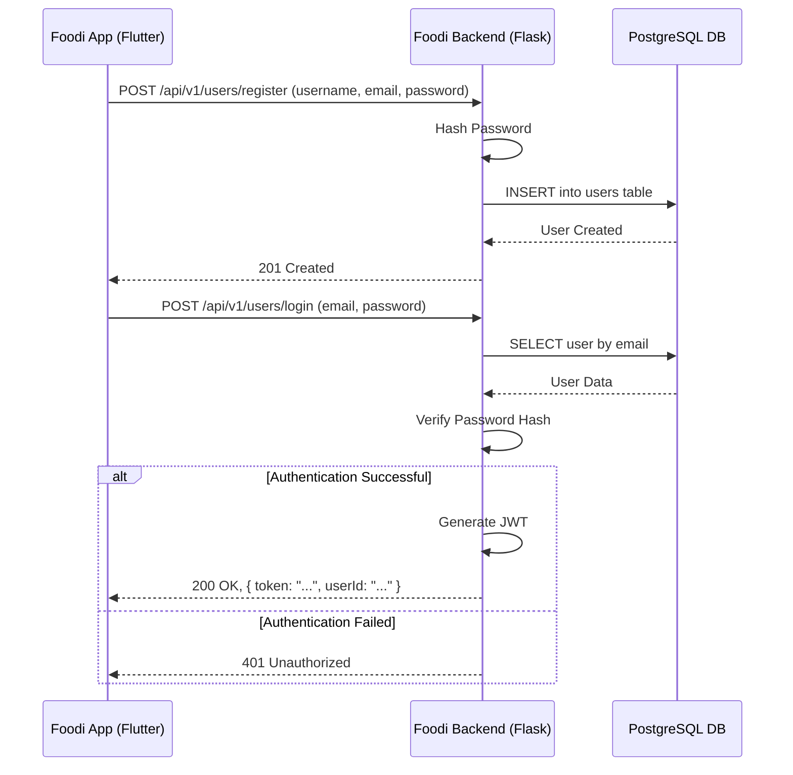
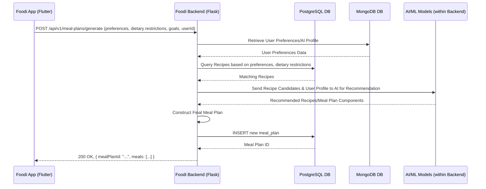

# Foodi Architecture Document

## Introduction / Preamble

This document outlines the overall project architecture for the Foodi application, including backend systems, shared services, and non-UI specific concerns. Its primary goal is to serve as the guiding architectural blueprint for AI-driven development, ensuring consistency and adherence to chosen patterns and technologies.

**Relationship to Frontend Architecture:**
If the project includes a significant user interface, a separate Frontend Architecture Document (typically named `front-end-architecture-tmpl.txt` or similar, and linked in the "Key Reference Documents" section) details the frontend-specific design and MUST be used in conjunction with this document. Core technology stack choices documented herein (see "Definitive Tech Stack Selections") are definitive for the entire project, including any frontend components.

## Technical Summary

The Foodi system's architecture is a **monolithic backend application** primarily leveraging Python Flask, with a separate Flutter application for cross-platform frontend development. It utilizes a hybrid database approach with PostgreSQL for structured relational data and MongoDB for unstructured data, particularly for AI-generated content and user preferences. The system will be deployed on Google Cloud Platform (GCP) using a single Cloud Run instance for the backend. This architecture aims to deliver personalized meal planning, nutritional tracking, and cooking guidance, fulfilling the core objectives outlined in the Foodi PRD, while maintaining simplicity for a non-production environment.

## High-Level Overview

The main architectural style is a **Monolith**, where all backend functionalities are consolidated into a single application. The project will maintain a **Polyrepo** approach, meaning the Flutter frontend and the Flask backend will each reside in their own distinct Git repositories, allowing for independent development and deployment of these two main components.

The primary user interaction flow involves the Flutter frontend communicating directly with the monolithic Flask backend application via a single API. This backend application then handles all logic, interacting with the necessary databases to fulfill requests and return data to the user interface.

```mermaid
graph LR
    subgraph User Interaction
        A[User] --> F[Foodi Flutter App (Mobile/Web)]
    end

    subgraph Foodi System
        subgraph Frontend
            F
        end

        subgraph Backend Monolith
            B[Foodi Backend Application (Flask)]
        end

        subgraph Data Stores
            C[PostgreSQL DB]
            D[MongoDB DB]
        end

        F -- REST API --> B
        B -- Read/Write User Data, Meal Plans, Recipes --> C
        B -- Read/Write User Preferences, Photo Analysis Data --> D
        B -- AI/ML Models --> B
    end

    F -- Displays Data --> A
```

## Architectural / Design Patterns Adopted

  - **Monolith:** To simplify development, deployment, and management for a non-production environment by consolidating all backend functionalities into a single application.
  - **Repository Pattern:** To abstract data access logic from the business logic, making the system more modular and testable within the monolith.
  - **Layered Architecture (Implicit):** The backend application will follow a layered approach, separating concerns into presentation (API endpoints), business logic (services), and data access (repositories).

## Component View

Here are the major logical components within the monolithic Foodi backend application, interacting with the frontend and databases:

```mermaid
graph TD
    subgraph Frontend Application
        FLA[Foodi Flutter Application]
    end

    subgraph Backend Monolith (Flask App)
        subgraph API Layer
            API_Endpoints[API Endpoints]
        end
        subgraph Service Layer
            UMS[User Management Logic]
            MPS[Meal Planning Logic]
            PAS[Photo Analysis Logic]
            RS[Recipe Logic]
        end
        subgraph AI/ML Modules
            AI_ML[AI/ML Models & Algorithms]
        end
        subgraph Data Access Layer
            PG_Repo[PostgreSQL Repositories]
            MONGO_Repo[MongoDB Repositories]
        end
    end

    subgraph Data Layer
        PG_DB[PostgreSQL Database]
        MONGO_DB[MongoDB Database]
    end

    FLA -- API Calls --> API_Endpoints

    API_Endpoints -- Invokes --> UMS
    API_Endpoints -- Invokes --> MPS
    API_Endpoints -- Invokes --> PAS
    API_Endpoints -- Invokes --> RS

    MPS -- Utilizes --> AI_ML
    PAS -- Utilizes --> AI_ML

    UMS -- Data Access --> PG_Repo
    MPS -- Data Access --> PG_Repo
    RS -- Data Access --> PG_Repo
    MPS -- Data Access --> MONGO_Repo
    PAS -- Data Access --> MONGO_Repo

    PG_Repo -- Interacts with --> PG_DB
    MONGO_Repo -- Interacts with --> MONGO_DB
```

  - **Foodi Flutter Application:** The user-facing application for mobile and web, built with Flutter. It handles UI rendering, user input, and communicates with the single Flask Backend Application.
  - **Backend Monolith (Flask App):** A single Python Flask application containing all backend functionalities:
      - **API Layer (API Endpoints):** Handles incoming HTTP requests, routes them to appropriate service logic, and manages input/output serialization.
      - **Service Layer:** Contains the core business logic for different domains (User Management, Meal Planning, Photo Analysis, Recipe Management). This layer orchestrates data flow and applies business rules.
      - **AI/ML Modules:** Integrated components within the Flask app responsible for AI-driven features like meal recommendations and photo analysis.
      - **Data Access Layer (Repositories):** Abstracts interaction with the databases, providing methods to persist and retrieve data for the services.
  - **PostgreSQL Database:** The primary relational data store for structured data such as user profiles, meal plan configurations, and core recipe attributes.
  - **MongoDB Database:** A NoSQL database for unstructured data like user preferences, AI-generated content, and potentially large binary objects (e.g., raw image files for analysis).

## Project Structure

Given a polyrepo structure, the Flutter frontend and the Flask backend will each reside in their own Git repositories. Below is a representative structure for the **Flask backend application** within its repository.

```plaintext
{backend-repo-root}/
├── .github/                       # CI/CD workflows (e.g., GitHub Actions)
│   └── workflows/
│       └── main.yml
├── .vscode/                       # VSCode settings (optional)
│   └── settings.json
├── build/                         # Compiled output (if applicable, often git-ignored)
├── config/                        # Static configuration files (if any)
├── docs/                          # Project documentation (PRD, Arch, etc.)
│   ├── index.md
│   └── ... (other .md files)
├── infra/                         # Infrastructure as Code (e.g., Terraform)
│   └── cloudrun/                  # Terraform for Cloud Run deployment
├── venv/                          # Python virtual environment (git-ignored)
├── scripts/                       # Utility scripts (build, deploy helpers, etc.)
├── src/                           # Application source code
│   ├── api/                       # API endpoint handlers, DTOs (e.g., controllers)
│   ├── core/                      # Core business logic, domain models, interfaces
│   ├── services/                  # Business services implementing core logic
│   ├── data_access/               # Database repositories (PostgreSQL, MongoDB)
│   ├── ml_models/                 # AI/ML model definitions and logic
│   ├── config/                    # Application-specific configuration loading
│   └── main.py                    # Main application entry point
├── test/                          # Automated tests
│   ├── unit/                      # Unit tests (mirroring src structure)
│   ├── integration/               # Integration tests
│   └── e2e/                       # End-to-end tests (for backend API)
├── .env.example                   # Example environment variables
├── .gitignore                     # Git ignore rules
├── requirements.txt               # Python dependencies
├── Dockerfile                     # Docker build instructions
└── README.md                      # Project overview and setup instructions
```

*(The Flutter frontend repository would have a similar structure, tailored for a Flutter project.)*

### Key Directory Descriptions

  - `docs/`: Contains all project planning and reference documentation.
  - `infra/`: Holds the Infrastructure as Code definitions (e.g., Terraform configurations for Cloud Run deployment, Cloud SQL instances, MongoDB Atlas integration).
  - `src/`: Contains the main application source code.
      - `src/api/`: Defines the API endpoints, request/response models (DTOs), and input validation logic.
      - `src/core/`: Encapsulates core business logic, domain models, and interfaces, independent of frameworks or external services.
      - `src/services/`: Implements the business services that orchestrate core logic and interact with data access and AI/ML modules.
      - `src/data_access/`: Contains implementations for interacting with databases (PostgreSQL and MongoDB).
      - `src/ml_models/`: Houses the code related to AI/ML models, including training, inference, and integration.
  - `test/`: Contains all automated tests, mirroring the `src/` structure where applicable.

### Notes

  - The `infra/` directory will contain GCP-specific Infrastructure as Code (e.g., Terraform configurations for the Cloud Run service, Cloud SQL instance, and MongoDB Atlas integration).
  - Python backend will use `requirements.txt` for dependency management.

## API Reference

### Internal APIs Provided (If Applicable)

#### Foodi Backend API (Monolith)

  - **Purpose:** The central API for the Foodi mobile and web frontend applications, consolidating all backend functionalities.
  - **Base URL(s):** `/api/v1/...`
  - **Authentication/Authorization:** Token-based authentication (e.g., JWT) for user sessions. Authorization will be handled via roles/permissions managed within the backend application.
  - **Endpoints:**
      - **`POST /users/register`:**
          - Description: Registers a new user.
          - Request Body Schema: `{ username: string, email: string, password: string, ...initial profile data }`
      - **`POST /users/login`:**
          - Description: Authenticates a user and returns a JWT.
          - Request Body Schema: `{ email: string, password: string }`
      - **`GET /users/profile`:**
          - Description: Retrieves the authenticated user's profile.
      - **`POST /meal-plans/generate`:**
          - Description: Generates a personalized meal plan.
          - Request Body Schema: `{ preferences: object, dietaryRestrictions: array, goals: object, ... }`
      - **`POST /photo-analysis/upload`:**
          - Description: Uploads a food photo for AI analysis.
          - Request Body Schema: `(multipart/form-data containing image file)`
      - **`GET /recipes/search`:**
          - Description: Searches the recipe database.
          - Request Parameters: `query: string, dietary_restrictions: array, ...`

*(Detailed request/response schemas will be documented within the specific API module or a dedicated `docs/data-models.md` if complex.)*

## Data Models

### Core Application Entities / Domain Objects

#### User

  - **Description:** Represents a Foodi user account and their profile information.
  - **Schema / Interface Definition:**
    ```python
    # Example using Python type hints / Pydantic (for API models)
    class User:
        id: str
        username: str
        email: str
        password_hash: str # Stored securely, never directly the password
        dietary_restrictions: list[str]
        cooking_experience_level: str
        nutritional_goals: dict
        budget_info: dict
        created_at: datetime
        updated_at: datetime
    ```
  - **Validation Rules:** `email` must be unique and valid format; `password_hash` minimum length; dietary restrictions from predefined list.

#### Recipe

  - **Description:** Represents a food recipe.
  - **Schema / Interface Definition:**
    ```python
    class Recipe:
        id: str
        name: str
        description: str
        ingredients: list[dict] # e.g., [{name: "flour", quantity: "1 cup"}]
        instructions: list[str]
        cuisine_type: str
        meal_type: str
        prep_time_minutes: int
        cook_time_minutes: int
        nutritional_info: dict # e.g., {calories: 300, protein: 20, fat: 10}
        source_url: str
        image_url: str
    ```

#### MealPlan

  - **Description:** A generated meal plan for a user, potentially for a day or a week.
  - **Schema / Interface Definition:**
    ```python
    class MealPlan:
        id: str
        user_id: str
        date: date
        meals: list[dict] # e.g., [{meal_type: "breakfast", recipe_id: "xyz"}, ...]
        total_nutrition_summary: dict # e.g., {calories: 2000, protein: 100}
        generated_by_ai: bool
        created_at: datetime
    ```

### Database Schemas (If applicable)

#### `users` Table (PostgreSQL)

  - **Purpose:** Stores Foodi user accounts and their associated profile data.
  - **Schema Definition:**
    ```sql
    CREATE TABLE users (
        id VARCHAR(36) PRIMARY KEY,
        username VARCHAR(255) NOT NULL,
        email VARCHAR(255) UNIQUE NOT NULL,
        password_hash VARCHAR(255) NOT NULL,
        dietary_restrictions TEXT[],
        cooking_experience_level VARCHAR(50),
        nutritional_goals JSONB,
        budget_info JSONB,
        created_at TIMESTAMP WITH TIME ZONE DEFAULT CURRENT_TIMESTAMP,
        updated_at TIMESTAMP WITH TIME ZONE DEFAULT CURRENT_TIMESTAMP
    );
    ```

#### `recipes` Table (PostgreSQL)

  - **Purpose:** Stores curated recipe data.
  - **Schema Definition:**
    ```sql
    CREATE TABLE recipes (
        id VARCHAR(36) PRIMARY KEY,
        name VARCHAR(255) NOT NULL,
        description TEXT,
        ingredients JSONB NOT NULL,
        instructions TEXT[] NOT NULL,
        cuisine_type VARCHAR(50),
        meal_type VARCHAR(50),
        prep_time_minutes INT,
        cook_time_minutes INT,
        nutritional_info JSONB,
        source_url VARCHAR(255),
        image_url VARCHAR(255)
    );
    ```

#### `meal_plans` Table (PostgreSQL)

  - **Purpose:** Stores generated meal plans for users.
  - **Schema Definition:**
    ```sql
    CREATE TABLE meal_plans (
        id VARCHAR(36) PRIMARY KEY,
        user_id VARCHAR(36) NOT NULL REFERENCES users(id),
        plan_date DATE NOT NULL,
        meals JSONB NOT NULL, -- e.g., array of {meal_type, recipe_id}
        total_nutrition_summary JSONB,
        generated_by_ai BOOLEAN DEFAULT TRUE,
        created_at TIMESTAMP WITH TIME ZONE DEFAULT CURRENT_TIMESTAMP
    );
    ```

#### `user_preferences` Collection (MongoDB)

  - **Purpose:** Stores flexible, unstructured user preference data that might evolve frequently, and AI-generated user models.
  - **Schema Definition (Example Document Structure):**
    ```json
    {
      "_id": "user_mongo_id_123",
      "userId": "user_pg_id_abc",
      "preferences": {
        "disliked_ingredients": ["cilantro", "olives"],
        "favorite_cuisines": ["Italian", "Mexican"],
        "spice_level": "medium",
        "meal_frequency": {
          "breakfast": "daily",
          "lunch": "daily",
          "dinner": "daily"
        }
      },
      "ai_profile": {
        "semantic_embeddings": [0.1, 0.2, ...],
        "meal_pattern_history": [
          {"date": "2023-01-01", "preference_drift": "vegetarian bias"},
          ...
        ]
      },
      "last_updated": "2023-10-27T10:00:00Z"
    }
    ```

## Core Workflow / Sequence Diagrams

### User Registration and Login Flow



### Meal Plan Generation Flow



## Definitive Tech Stack Selections

| Category           | Technology            | Version / Details                                  | Description / Purpose                                    | Justification (Optional)                                                               |
| :----------------- | :-------------------- | :------------------------------------------------- | :------------------------------------------------------- | :------------------------------------------------------------------------------------- |
| **Languages** | Python                | 3.11                                               | Primary language for the backend monolith and AI/ML.     | Strong ecosystem for AI/ML, good for backend APIs, and widely supported on GCP.        |
|                    | Dart                  | 3.x (Latest Stable)                                | Primary language for Flutter frontend.                   | Enables single codebase for cross-platform mobile and web applications.                |
| **Frameworks** | Flask                 | 2.x (Latest Stable)                                | Lightweight backend API framework for the monolith.      | Flexible, minimal overhead, well-suited for RESTful APIs and consolidating logic.      |
|                    | Flutter               | 3.x (Latest Stable)                                | Frontend UI framework.                                   | Cross-platform development efficiency and native-like performance.                     |
| **Databases** | PostgreSQL            | 15                                                 | Primary relational data store for structured data.       | Robust, ACID compliant, widely used for user data, recipes, meal plans.                |
|                    | MongoDB               | 6.x (Latest Stable)                                | NoSQL document database for unstructured data.           | Flexible schema for user preferences, AI-generated content, image metadata.            |
| **Cloud Platform** | Google Cloud Platform | N/A                                                | Primary cloud provider.                                  | Integrated AI services, scalable compute options, strong container ecosystem.          |
| **Cloud Services** | Cloud Run             | N/A                                                | Serverless compute for the backend monolith.             | Auto-scaling, cost-effective, easy deployment of containerized services.               |
|                    | Cloud SQL (PostgreSQL)| N/A                                                | Managed PostgreSQL service.                              | Reduces operational overhead for database management.                                  |
|                    | MongoDB Atlas         | N/A                                                | Managed MongoDB service (preferred over self-hosting).   | Fully managed, highly scalable, and reliable MongoDB deployments.                      |
|                    | Cloud Storage         | N/A                                                | Object storage for static assets (images, files).        | Scalable, highly available, secure storage for user-uploaded images and app assets.    |
|                    | Vertex AI / AI Platform| N/A                                                | For deploying and managing AI/ML models.                 | Integrated with GCP, scalable for AI inference, MLOps capabilities.                    |
| **Infrastructure** | Terraform             | Latest                                             | Infrastructure as Code tool.                             | Declarative configuration for managing GCP resources, promoting consistency.           |
|                    | Docker                | Latest                                             | Containerization of the backend application.             | Ensures consistent environments from development to production.                        |
| **UI Libraries** | Flutter Material Design| Included with Flutter                              | UI component library for consistent design.              | Provides a rich set of pre-built, customizable UI widgets.                             |
| **State Management**| Provider / Riverpod   | Latest (for Flutter)                               | Frontend state management for Flutter.                   | Efficient, scalable, and easy-to-use patterns for managing application state.          |
| **Testing** | PyTest                | Latest                                             | Unit/Integration testing framework for Python.           | Widely adopted, extensible, and good for writing concise tests.                        |
|                    | Flutter Test          | Included with Flutter                              | Unit/Widget/Integration testing for Flutter.             | Comprehensive testing utilities built into the Flutter SDK.                            |
|                    | Playwright            | Latest                                             | End-to-end testing framework (for web).                  | Reliable browser automation for E2E tests across different browsers.                   |
| **CI/CD** | GitHub Actions        | N/A                                                | Continuous Integration/Deployment pipeline.              | Integrates well with GitHub repositories, provides robust automation capabilities.     |
| **Other Tools** | Pydantic              | Latest                                             | Data validation and settings management (Python).        | Enforces data schemas and simplifies configuration for Flask application.             |
|                    | SQLAlchemy            | Latest                                             | ORM for PostgreSQL (Python).                             | Provides an object-relational mapping layer for easier database interaction.           |
|                    | LangChain (Python)    | Latest                                             | LLM interaction library (if needed for complex AI flows).| Simplifies integration with large language models for AI features.                     |
|                    | Pillow                | Latest                                             | Image processing library (Python).                       | Essential for handling image uploads and preparing them for AI analysis.               |
|                    | Flask-JWT-Extended    | Latest                                             | JWT authentication for Flask.                            | Provides secure and standard way to handle user authentication tokens.                 |

## Infrastructure and Deployment Overview

  - **Cloud Provider(s):** Google Cloud Platform (GCP)
  - **Core Services Used:** Cloud Run, Cloud SQL (PostgreSQL), MongoDB Atlas, Cloud Storage, Vertex AI
  - **Infrastructure as Code (IaC):** Terraform
      - **Location:** The backend repository will have an `infra/cloudrun/` directory containing its specific Terraform configurations for the Cloud Run instance, Cloud SQL, and MongoDB Atlas connections.
  - **Deployment Strategy:** CI/CD pipeline with automated deployments to development and staging environments. Production deployments will require manual approval after successful automated tests and staging verification.
      - **Tools:** GitHub Actions
  - **Environments:** Development, Staging, Production
  - **Environment Promotion:**
      - `dev` -\> `staging`: Automated upon successful CI builds and unit/integration tests in the `dev` branch for both frontend and backend.
      - `staging` -\> `production`: Automated after all tests pass in `staging` and a manual approval step.
  - **Rollback Strategy:** Automated rollback on health check failure post-deployment (Cloud Run's built-in features). Manual rollback via CI/CD job or reverting IaC state if necessary for more complex issues.

## Error Handling Strategy

  - **General Approach:** Use exceptions as the primary mechanism for signaling errors within the backend application. API endpoints will return standardized JSON error responses to the frontend. Custom error types will be defined for domain-specific errors.
  - **Logging:**
      - **Library/Method:** Python's standard `logging` module with structured logging (e.g., `python-json-logger` for JSON output). Flutter will use a custom logging solution that outputs structured logs.
      - **Format:** JSON for all server-side logs to enable easy parsing and analysis in log management systems (e.g., Google Cloud Logging).
      - **Levels:** `DEBUG`, `INFO`, `WARN`, `ERROR`, `CRITICAL`.
          - `DEBUG`: Detailed information, typically only of interest when diagnosing problems.
          - `INFO`: Confirmation that things are working as expected.
          - `WARN`: An indication that something unexpected happened, or indicative of a problem.
          - `ERROR`: Due to a more serious problem, the software has not been able to perform some function.
          - `CRITICAL`: A serious error, indicating that the program itself may be unable to continue running.
      - **Context:** All logs must include a correlation ID (for tracing requests from frontend to backend), application name, operation name, and sanitized relevant parameters. User IDs (if applicable and safe) may be included for debugging.
  - **Specific Handling Patterns:**
      - **External API Calls:** Implement retry mechanisms with exponential backoff for transient network errors (e.g., using `tenacity` in Python). Circuit breaker patterns will be considered for unstable external services to prevent cascading failures. Timeouts (connect and read) will be configured for all external HTTP requests. API errors (4xx, 5xx) from external services will be caught and translated into appropriate internal errors or user-facing messages.
      - **Internal Errors / Business Logic Exceptions:** Custom exception classes will be defined (e.g., `UserNotFoundError`, `InvalidMealPlanError`) inheriting from a base `AppError`. These will be caught at the API boundaries and translated into generic, user-friendly error messages for the client, along with a unique error ID for internal debugging.
      - **Transaction Management:** PostgreSQL will leverage its native ACID transactions for ensuring data consistency in multi-step operations within the backend.

## Coding Standards

These standards are mandatory for all code generation by AI agents and human developers. Deviations are not permitted unless explicitly approved and documented as an exception in this section or a linked addendum.

  - **Primary Runtime(s):** Python 3.11, Flutter 3.x
  - **Style Guide & Linter:**
      - **Python:** Black for code formatting, Flake8 for linting, and MyPy for static type checking. Configuration files (`pyproject.toml`, `.flake8`) will be committed.
      - **Flutter/Dart:** Dart Format for code formatting, and the `analysis_options.yaml` file will enforce linting rules.
  - **Naming Conventions:**
      - **Variables:** `snake_case` (Python/Dart)
      - **Functions/Methods:** `snake_case` (Python/Dart)
      - **Classes/Types/Interfaces:** `PascalCase` (Python/Dart)
      - **Constants:** `UPPER_SNAKE_CASE` (Python/Dart)
      - **Files:** `snake_case.py` (Python), `kebab_case.dart` (Dart)
      - **Modules/Packages:** `snake_case` (Python), `kebab_case` (Dart)
  - **File Structure:** Adhere to the layout defined in the "Project Structure" section for both backend and frontend repositories.
  - **Unit Test File Organization:**
      - **Python:** `test_*.py` files co-located in a parallel `tests/unit/` directory.
      - **Flutter/Dart:** `*_test.dart` files co-located with the source files in `test/unit/` and `test/widget/` directories.
  - **Asynchronous Operations:**
      - **Python:** Always use `async`/`await` for asynchronous operations, especially for I/O bound tasks in Flask (if using ASGI).
      - **Flutter/Dart:** Always use `Future`/`async`/`await` for asynchronous operations.
  - **Type Safety:**
      - **Python:** All new code must have full type hints. MyPy will be run in CI with strict settings (`disallow_untyped_defs = True`).
      - **Flutter/Dart:** Leverage Dart's sound null safety. All new code must be strictly typed.
      - *Type Definitions:* Located within the respective application's `src/core/` or `src/api/` directories, or shared packages. The use of `Any` (Python) or `dynamic` (Dart) is strongly discouraged and requires explicit justification.
  - **Comments & Documentation:**
      - **Code Comments:** Explain *why* for complex logic, not *what*. Avoid redundant comments. Use Python docstrings (Google/NumPy style) and Dart documentation comments for public APIs.
      - **READMEs:** Each repository (backend, frontend) should have a `README.md` explaining its purpose, setup, and usage.
  - **Dependency Management:**
      - **Python:** `pip` with `requirements.txt` (pinned versions preferred).
      - **Flutter/Dart:** `pub` with `pubspec.yaml` (pinned versions preferred).
      - Policy on adding new dependencies: Requires team discussion and approval, check for existing alternatives, and automated security vulnerability scans in CI.

### Detailed Language & Framework Conventions

#### Python Specifics

  - **Immutability:** Use tuples for immutable sequences. For data classes, consider `@dataclass(frozen=True)`. Be mindful of mutable default arguments in function definitions.
  - **Functional vs. OOP:** Employ classes for representing entities, services, and repositories. Use functions for stateless transformations or utilities. List comprehensions and generator expressions are preferred for data manipulation.
  - **Error Handling Specifics:** Always raise specific, custom exceptions inheriting from a base `AppException`. Use `try-except-else-finally` blocks appropriately. Avoid broad `except Exception:` clauses without re-raising or specific handling.
  - **Resource Management:** Always use `with` statements for resources like files or database connections to ensure proper cleanup.
  - **Type Hinting:** All new functions and methods must have full type hints. MyPy must be run in CI. Strive for `disallow_untyped_defs = True`.
  - **Logging Specifics:** Use the `logging` module configured for structured output (e.g., with `python-json-logger`). Include correlation IDs in all log messages. Do not log sensitive PII. Use appropriate log levels.
  - **Framework Idioms (Flask):** Follow a modular structure for Flask applications (e.g., using Blueprints). Utilize Pydantic for request/response models and data validation.
  - **Key Library Usage Conventions:** For HTTP requests, use `requests` or `httpx` with explicit timeout settings. For data manipulation, prefer Pandas where appropriate but be mindful of performance.
  - **Code Generation Anti-Patterns to Avoid:** Avoid overly nested conditional logic (max 2-3 levels). Avoid single-letter variable names (except for trivial loop counters). Do not bypass Flask's security features.

#### Flutter Specifics

  - **Immutability:** Always prefer immutable data structures. Use `final` and `const` keywords appropriately. Avoid direct mutation of objects passed as props or state. Consider packages like `freezed` or `built_value` for immutable data models.
  - **Functional vs. OOP:** Flutter encourages a widget-based, declarative UI. Components should be small and focused. Use classes for models, services, and state management (e.g., Provider/Riverpod).
  - **Error Handling Specifics:** Ensure `Future` rejections are always `Error` objects. Use `try-catch` for asynchronous operations. Define custom `AppException` classes for domain-specific errors.
  - **Null Safety:** Strict null safety must be enabled. Avoid the `!` non-null assertion operator; prefer explicit null checks, optional chaining (`?.`), or nullish coalescing (`??`).
  - **State Management:** Adhere to the chosen state management solution (Provider/Riverpod). Define clear patterns for managing local widget state and global application state. Avoid `setState` in StatelessWidget.
  - **Logging Specifics:** Use the chosen structured logging solution. Include correlation IDs. Do not log sensitive PII.
  - **Framework Idioms:** Follow Flutter's widget composition principle. Separate UI from business logic. Use `BuildContext` correctly. Manage widget lifecycle.
  - **Key Library Usage Conventions:** For HTTP requests, use the `http` package with explicit timeout settings. For date/time, use `intl` package or `DateTime` appropriately.
  - **Code Generation Anti-Patterns to Avoid:** Avoid deeply nested widget trees without proper refactoring. Do not ignore linter warnings. Avoid using `dynamic` where a specific type can be inferred.

## Overall Testing Strategy

This section outlines the project's comprehensive testing strategy, which all AI-generated and human-written code must adhere to. It complements the testing tools listed in the "Definitive Tech Stack Selections".

  - **Tools:** PyTest, Flutter Test (Unit, Widget, Integration), Playwright.
  - **Unit Tests:**
      - **Scope:** Test individual functions, methods, classes, or small modules in isolation. Focus on business logic, algorithms, and transformation rules.
      - **Location:** Python: `test_*.py` co-located in a parallel `tests/unit/` directory. Flutter: `*_test.dart` co-located with source files in `test/unit/` and `test/widget/` directories.
      - **Mocking/Stubbing:** Python: `unittest.mock` or `pytest-mock`. Flutter: `mockito`. Mock all external dependencies (network calls, file system, databases, time).
      - **AI Agent Responsibility:** AI Agent must generate unit tests covering all public methods, significant logic paths, edge cases, and error conditions for any new or modified code.
  - **Integration Tests:**
      - **Scope:** Test the interaction between several components or layers within the monolithic backend. E.g., API endpoint to service layer to database (using a test database or in-memory version). For frontend, interaction between widgets and state management.
      - **Location:** Python: `/tests/integration/`. Flutter: `test/integration/`.
      - **Environment:** Use Testcontainers for spin-up of test databases (PostgreSQL, MongoDB) or in-memory versions where feasible. Dedicated test environments on GCP for full-stack integration tests.
      - **AI Agent Responsibility:** AI Agent may be tasked with generating integration tests for key application flows or API endpoints based on specifications.
  - **End-to-End (E2E) Tests:**
      - **Scope:** Validate complete user flows or critical paths through the system from the user's perspective (e.g., UI interaction, API call sequence through the backend).
      - **Tools:** Playwright (for web and potentially mobile app automation).
      - **AI Agent Responsibility:** AI Agent may be tasked with generating E2E test stubs or scripts based on user stories or BDD scenarios. Focus on critical happy paths and key error scenarios.
  - **Test Coverage:**
      - **Target:** Aim for 80% line/branch coverage for unit tests as a guideline. Quality of tests (testing correct behavior, not just lines) is paramount.
      - **Measurement:** Coverage.py (Python), `flutter test --coverage` (Dart).
  - **Mocking/Stubbing Strategy (General):** Prefer fakes or test doubles over extensive mocking where it improves test clarity and maintainability. Strive for tests that are fast, reliable, and isolated.
  - **Test Data Management:** Use factories or fixtures for creating test data. Ensure test data is isolated per test run to prevent contamination. Setup/teardown scripts will be used to clean environments.

## Security Best Practices

Outline key security considerations relevant to the codebase. These are mandatory and must be actively addressed by the AI agent during development.

  - **Input Sanitization/Validation:**
      - **Python:** Use Pydantic for all API input validation and data serialization at the API endpoint layer. All validation rules must be defined in Pydantic models.
      - **Flutter:** Perform client-side validation for immediate user feedback, but always re-validate all inputs on the server-side.
      - Validation must occur at the API boundary before processing.
  - **Output Encoding:**
      - **Flutter:** Ensure all dynamic data rendered in UI is properly encoded to prevent injection attacks. Flutter widgets handle most of this inherently, but be mindful when rendering raw HTML or custom text.
      - **Python:** When returning data, ensure it's properly serialized to JSON. Avoid generating raw HTML unless explicitly required and carefully encoded.
  - **Secrets Management:** Reference `docs/environment-vars.md` regarding storage for different environments. In code, access secrets *only* through a designated configuration module/service. Never hardcode secrets, include them in source control, or log them. Use `.env` files (git-ignored) for local development. For deployment, use GCP Secret Manager or environment variables managed by Cloud Run.
  - **Dependency Security:** Run automated vulnerability scans (e.g., `pip-audit`, `pub audit`, Snyk, Dependabot alerts) as part of CI. Update vulnerable dependencies promptly based on severity. New dependencies must be vetted for known vulnerabilities and actively maintained.
  - **Authentication/Authorization Checks:**
      - All API endpoints (except explicitly public ones like `/register`, `/login`) must enforce authentication using Flask-JWT-Extended in the Python backend.
      - Authorization (permission/role checks) must be performed at the service layer for protected resources after authentication.
      - Flutter app will securely store JWT tokens (e.g., using `flutter_secure_storage`).
  - **Principle of Least Privilege (Implementation):**
      - Database connection users (PostgreSQL, MongoDB) must have only the necessary permissions (SELECT, INSERT, UPDATE, DELETE) for the specific tables/collections they access.
      - GCP IAM roles for the Cloud Run service, Cloud SQL, MongoDB Atlas, and Cloud Storage must be narrowly scoped to the required actions and resources.
  - **API Security (General):** Enforce HTTPS for all communication. Implement rate limiting and throttling at the Flask application level (e.g., using Flask-Limiter). Use standard HTTP security headers (CSP, HSTS, X-Frame-Options, X-Content-Type-Options) on the Flask application. Follow REST best practices, including proper HTTP methods and status codes.
  - **Error Handling & Information Disclosure:** Ensure error messages do not leak sensitive information (stack traces, internal paths, detailed SQL errors) to the end-user. Log detailed errors server-side, provide generic messages or unique error IDs to the client.
  - **Regular Security Audits/Testing:** Implement periodic security reviews. Consider static application security testing (SAST) and dynamic application security testing (DAST) tools in CI/CD pipeline.

## Key Reference Documents

  - [Foodi Product Requirements Document (PRD)](uploaded:Foodi PRD(2).txt)

## Change Log

| Change | Date | Version | Description | Author |
| ------ | ---- | ------- | ----------- | ------ |
| Initial Draft | 2025-05-26 | 0.1 | Initial architecture document based on PRD and discussions. | Fred (Architect Agent) |
| Revised to Monolith | 2025-05-26 | 0.2 | Changed architecture from microservices to a backend monolith with separate frontend repo. | Fred (Architect Agent) |

-----

How does this revised architecture document look? Are there any other adjustments you'd like to make?